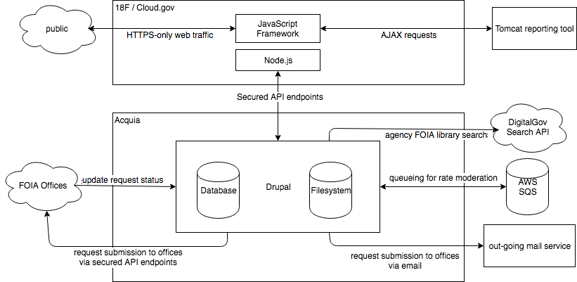

# DOJ FOIA Project Back-end System Documentation

## Project Description
The FOIA project's overall vision is to create a single portal through which the public can submit Freedom of Information Act (FOIA) requests to any federal agency.  The project was mandated by the [FOIA Improvement Act of 2016](https://www.justice.gov/oip/freedom-information-act-5-usc-552).  This new portal will provide functionality to replace both https://foia.gov and https://open.foia.gov.

Architecturally the effort is being divided into two parts; a front-end site being developed by 18F and a decoupled, D8 back-end being developed by Acquia.  For purposes of this document, only the back-end system will be considered.

## Architecture

### Overview
The high-level overview of the total system (including the front- and back- ends) can be found below. This diagram was generated with draw.io. For archival and editing purposes, an [XML representation](./assets/FOIADiagram.xml) is included in the `assets`directory.  This XML can be uploaded to draw.io and manipulated in that tool in order to keep the diagram up to date.

In summary, the public will interact with the system via a front-end system developed and hosted independantly of the back-end system described here.  The front-end will communicate with the back-end via Rest API endpoints adhering to the JSONAPI specification.

The back-end system will: 

* provide JSONAPI endpoints for 
    * listing FOIA Offices
    * retrieving details on a specified FOIA Office (including the structure of the request form for that Office)
    * retrieving the status and allowed details of a specified FOIA Request
    * submitting a FOIA Request
    * updating the status of a FOIA Request (restricted to allow only recognized users of this service)
* manage queueing as necessary to ensure the stability of the back-end system during high-traffic events or DDoS
* validate incoming FOIA Requests against the submission form settings for the relevant FOIA Office
* transmit validated FOIA Requests to the relevant FOIA Office using an exchange mechanism preconfigured for that Office
* send email to submitters of FOIA Requests when the status of their Request is updated
* provide a secured web UI to allow Non-public users to login and create or update content.

### Back-end Implementation
The back-end is being implemented as a headless Drupal 8 instance, to be hosted on Acquia Cloud Enterprise, built on the [Lightning distribution](https://github.com/acquia/lightning) and borrowing numerous approaches/configurations from the [Reservoir project](https://github.com/acquia/reservoir).

### Content Model
The conceptual objects which with the back-end works are:

#### Department/Agency
These are implemented as a Drupal vocabulary where each term represents a federal department or agency (e.g., Department of Defense), which may contain 1 or more FOIA Offices.

#### FOIA Office
A FOIA Office is a single FOIA request handling entity within a Department/Agency. The FOIA Office has a description, one or more points of contact with which the public can correspond, one or more means of receiving FOIA Requests (e.g., email, fax, API endpoint), as well as a FOIA Request Form.

FOIA Offices are implemented as custom nodes.

The FOIA Office is associated with a single Department/Agency by a taxonomy reference field and with a single FOIA Request Form by an entity reference field.

#### FOIA Request Form
A FOIA Request Form defines the collection of fields which make up the required and optional submission elements for a FOIA Request to a specified FOIA Office.

FOIA Request Forms are implemented as [Webform](https://drupal.org/project/webform) entities and are created by users associated with the relevant FOIA Office using the standard Webform creation interface.

#### FOIA Request
A FOIA Request is a single submission of a FOIA Request Form.

### Important Functionality
This section describes functionality which is specific to this site or which uses custom modules for implementation.

#### Users Restricted to Editing Only FOIA Offices Associated with their Account
*@TODO: describe this functionality when development is complete*

#### Templating of FOIA Request Forms
On the assumption/understanding that most FOIA Request Forms have an overlap in core fields which the user is asked to complete (e.g., name, email), the back-end provides functionality for creating a new FOIA Request Form from a pre-defined template which includes those common fields.  The new form based on the template can then add fields which are specific to that agency.

This functionality is supplied by the custom [Webform Template module](https://github.com/usdoj/foia/tree/develop/docroot/modules/custom/webform_template).  For details on use and creation of the template, see the README.me supplied with that module.

#### Receipt and Validation of FOIA Requests
*@TODO: describe this functionality when development is complete*

#### Queueing
*@TODO: describe this functionality when development is complete*

#### Submission of FOIA Requests to Receiving Offices
*@TODO: describe this functionality when development is complete*

### User Roles and Permissions

*@TODO: describe established roles and permissions when development is complete*